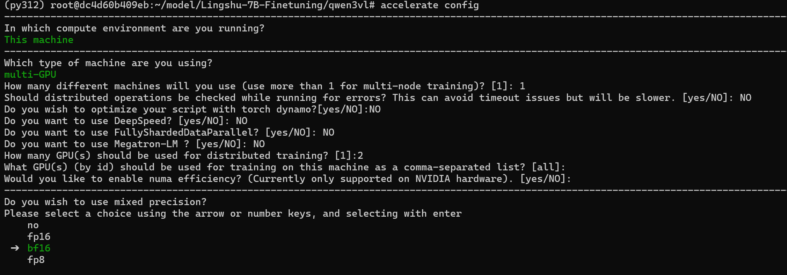

# Lingshu-7B-Finetuning
VLM finetuning

## Download code
```bash
cd /mnt/d/skinalor/model

git clone https://github.com/william-lijunxuan/Lingshu-7B-Finetuning.git
```


## Download model
Download it to the **model** directory.
```bash
cd /mnt/d/skinalor/model

git clone https://huggingface.co/lingshu-medical-mllm/Lingshu-7B
```

## Download dataset
Download it to the **dataset** directory.
```bash
cd /mnt/d/skinalor/dataset

git clone https://huggingface.co/datasets/redlessone/Derm1M

cd Derm1M

# Unzip the file
for file in *.zip; do
    unzip -o "$file" -d "${file%.zip}"
done
#unzip validation_data.zip -d validation_data
#unzip IIYI.zip -d IIYI
#unzip edu.zip -d edu
#unzip note.zip -d note
#unzip public.zip -d public
#unzip pubmed.zip -d pubmed
#unzip reddit.zip -d reddit
#unzip twitter.zip -d twitter
#unzip youtube.zip -d youtube

```
## Create conda env

```bash
cd Lingshu-7B-Finetuning

conda env update -f environment.yml --prune

conda activate lingshu

cd qwenvl/scripts

bash sft_lingshu_7b.sh
```

##  Login wandb
```bash
wandb
mr.william.ljx@gmail.com 
1be3c3080c7714f2f5e1c1fb9e78ec54bdbc0193
```


## Qwen3VL_4b

```bash
cd /Lingshu-7B-Finetuning/qwen3vl
accelerate config
accelerate launch --num_processes=2 --mixed_precision=bf16 Qwen3VL_4b.py
```